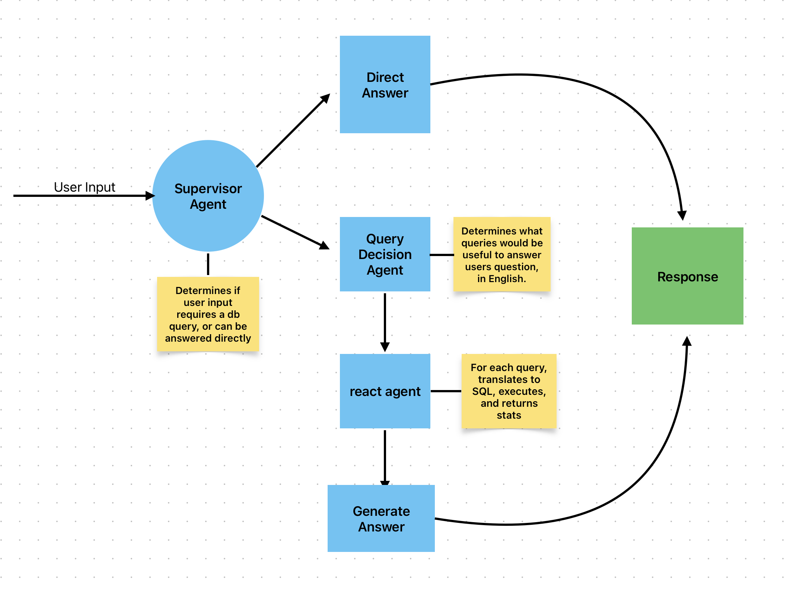
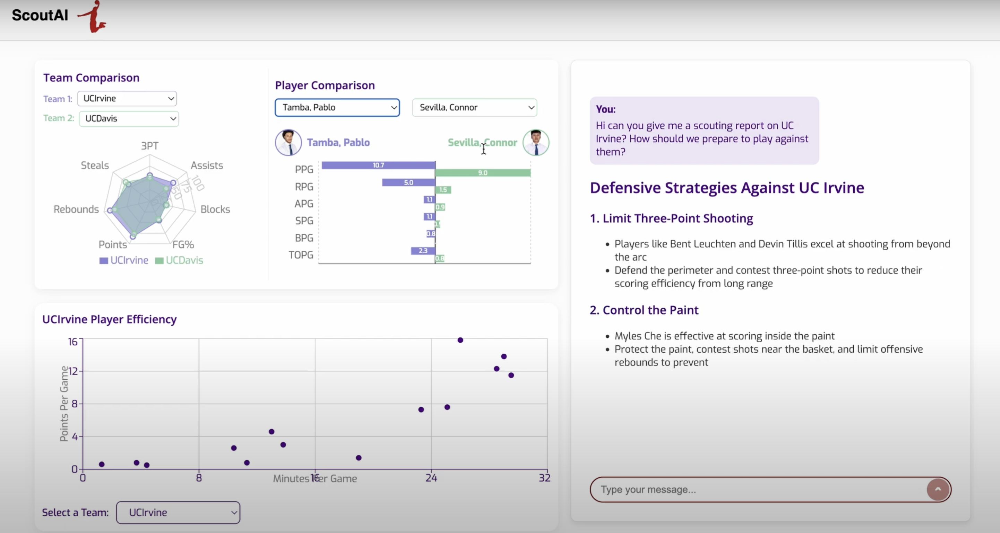

# ScoutAI 🏀

**ScoutAI** is an end‑to‑end web application that lets coaches, analysts, and hoops fanatics explore NCAA basketball data with a single click—or a single question.  It marries an interactive React front‑end with a Flask + SQLite API and sprinkles in an LLM agent pipeline so you can literally *chat* with your data.

---

## Table of Contents

1. [Features](#features)
2. [Architecture Overview](#architecture-overview)
3. [Tech Stack](#tech-stack)
4. [Quick Start](#quick-start)
5. [Demo](#Demo)

---

## Features

| Category                  | What you can do                                                                                                                                                                                  |
| ------------------------- | ------------------------------------------------------------------------------------------------------------------------------------------------------------------------------------------------ |
| **Visual Analytics**      | • Player‑vs‑Player bar charts  <br/>• Team radar charts  <br/>• Player efficiency scatter plots  <br/>• **Dynamic refresh:** charts automatically update based on your most recent chatbot query |
| **LLM Chat Assistant**    | • Ask plain‑English questions (e.g. *“How did our 3‑pt % trend over conference play?”*)  <br/>• Natural‑language SQL generation & execution                                                      |
| **Contextual Benchmarks** | • Compare any team/player against conference averages                                                                                                                                            |
| **Plug‑and‑Play DB**      | • Swap in your own SQLite DB with the same schema                                                                                                                                                |

---

## Architecture Overview


*Figure 1 – The multi‑agent flow that powers natural‑language queries. A **Supervisor Agent** chooses between direct answers or database queries, which are delegated down the chain and returned as a polished response.*

---

## Tech Stack

| Layer            | Tools & Libraries                     |
| ---------------- | ------------------------------------- |
| **Frontend**     | React • Recharts • Axios              |
| **Backend API**  | Flask • SQLite • Pandas               |
| **LLM Pipeline** | LangChain ReAct agent • OpenAI GPT‑4o |
| **Styling**      | Tailwind CSS + custom styles          |

---

## Quick Start

### Prerequisites

* Node ≥ 16
* Python ≥ 3.8
* SQLite (or your favourite RDBMS)
* An OpenAI API key in your environment (`OPENAI_API_KEY`)

### 1 – Clone & Install

```bash
# clone
$ git clone https://github.com/nmaffly/SmartAnalytics.git
$ cd SmartAnalytics

# frontend deps
$ cd react-frontend && npm i && cd ..

# backend deps
$ cd flask-backend && pip install -r requirements.txt && cd ..
```

### 2 – Database

Drop your `ucd-basketball.db` inside **`flask-backend/`** (or update `DB_PATH` in `app.py`).

### 3 – Environment Vars

Create **`flask-backend/.env`**:

```
OPENAI_API_KEY=sk-...  # required for chat assistant
DB_PATH=ucd-basketball.db
FLASK_ENV=development
```

### 4 – Run

```bash
# backend
$ cd flask-backend && python app.py   # -> http://localhost:5001

# frontend (in another terminal)
$ cd react-frontend && npm start      # -> http://localhost:3000
```

Open [http://localhost:3000](http://localhost:3000) in your browser and start exploring! 🔍🏀

---

## Demo

> Check out a 2‑min walkthrough showcasing natural‑language queries, live charts, and the overall UX.
>
[](https://youtu.be/13Nr5UfkLH4)


---

> Built with 💙 at UC Davis to make hoops analytics less about scraping CSVs and more about asking good questions.
> Looking for more cool sports‑analytics projects? Check out more at Aggie Sports Analytics → https://aggiesportsanalytics.com
